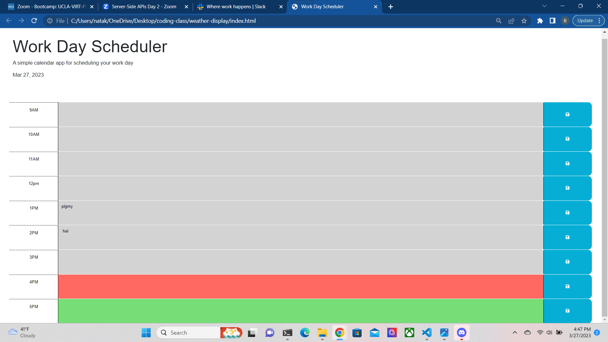

# WorkDayScheduler

## Description
    Primary objectives: To apply Javascript so as to be able to modify and save information and make use of api's as resources to update a planner with correct time and date. 

    Process:   
    Pull data from  dayjs to create a functioning time/date display. Create memory on local storage for each time slot and a function that saves information for each time slot independently from each other. Create a function that modifies the background of each time slot to denote whether it is past, present, or future.

## Installation

    Download repository from github links.
    https://github.com/EspadaSworn/daily-schedule
    
    Main website
    https://espadasworn.github.io/daily-schedule/
    
## Usage

    To be used to create a website with organized flow so as to be able to save information on shifts and note if times can be modified or have passed. 

## Credits

